项目传送门：https://github.com/WillKen/AnimationDemo

视频演示：[AnimationDemo｜游戏Demo演示-哔哩哔哩](https://b23.tv/Qik4Q8m)
# 开发环境

操作系统：macOS Monterey 12.5 （MacBook pro M1）

游戏引擎：UE4.27.2

# 动画技术简介

## Movement & Walk/Run

移动的方向，要基于当前朝向(Yaw)进行计算。

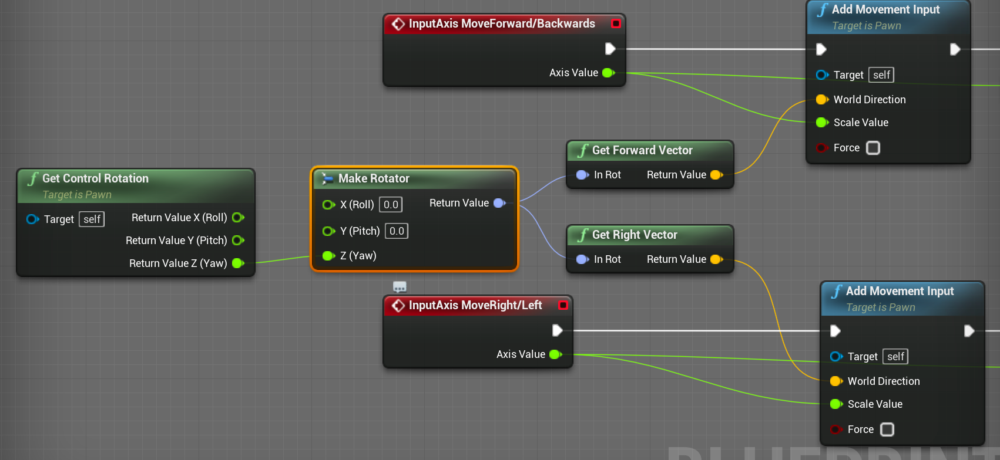

使用混合动画来实现跑和走的切换。

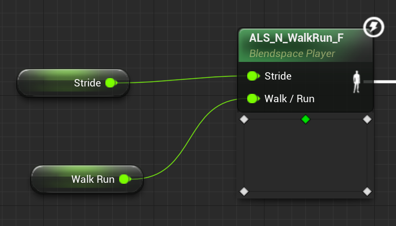

## Jump & Crouch

利用状态机实现走跑与跳跃的切换。当MovementState为In Air时切换为Jump；当MovementState不为In Air时，切换为Land。

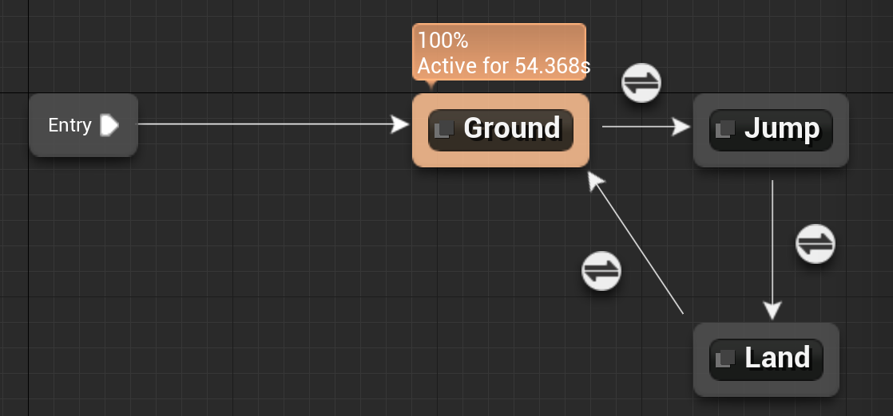

利用状态机实现走跑与下蹲行走的切换。当MovementState为Crouching时切换为Crouch；当MovementState不为Crouching时，切换为Stand。

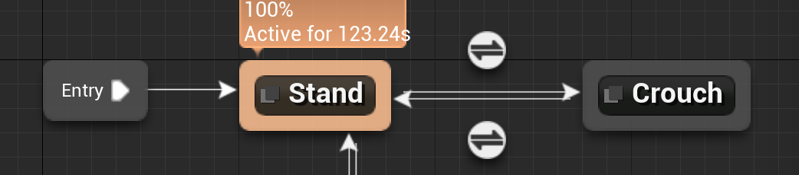

## Sprint & Camera Shake （动画通知）

首先仍然是利用状态机实现走跑与冲刺的切换。

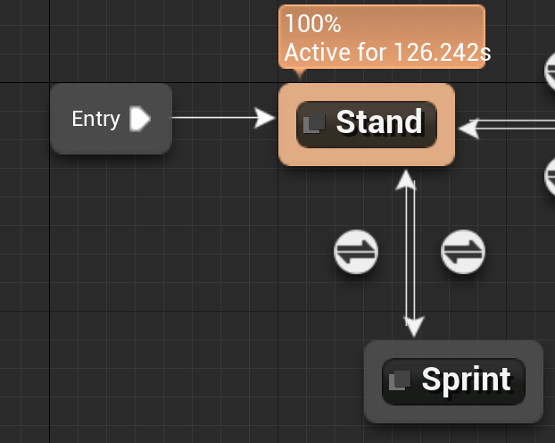

通知事件蓝图（冲刺时实现相机抖动）

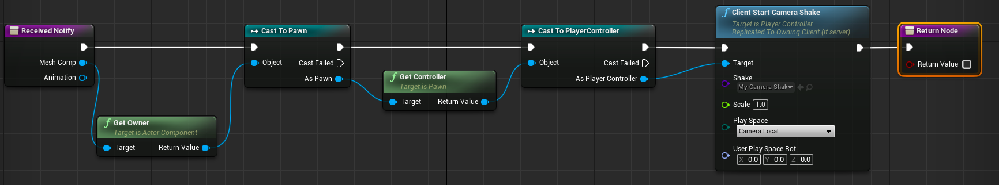

通知事件的位置。

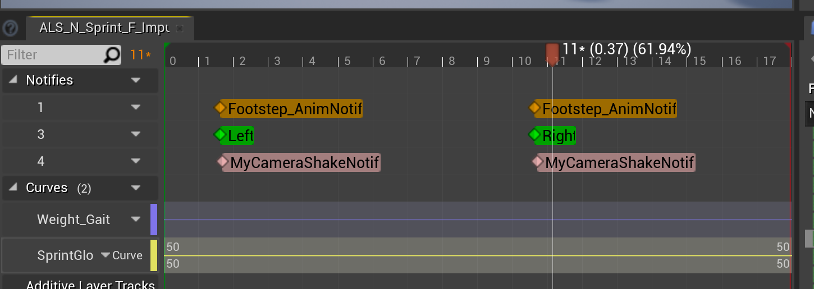

## Stretch Hand（双骨骼IK）

利用状态机实现Movement与伸手状态的切换。

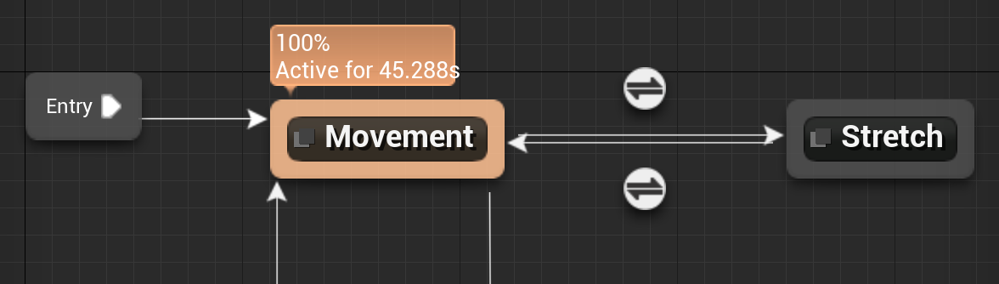

伸手时，对右手骨骼进行Two Bone IK。

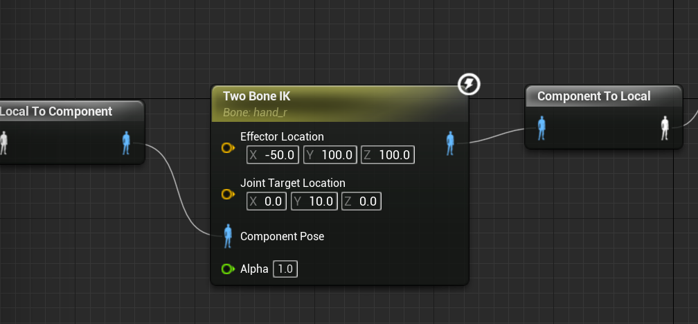

## Look Around（动画层接口与AimOffset）

当按下V进行Anim Class Layers关联，松开V取消关联。动画层接口分别被MyAnimBP动画蓝图和AimingBP动画蓝图使用。

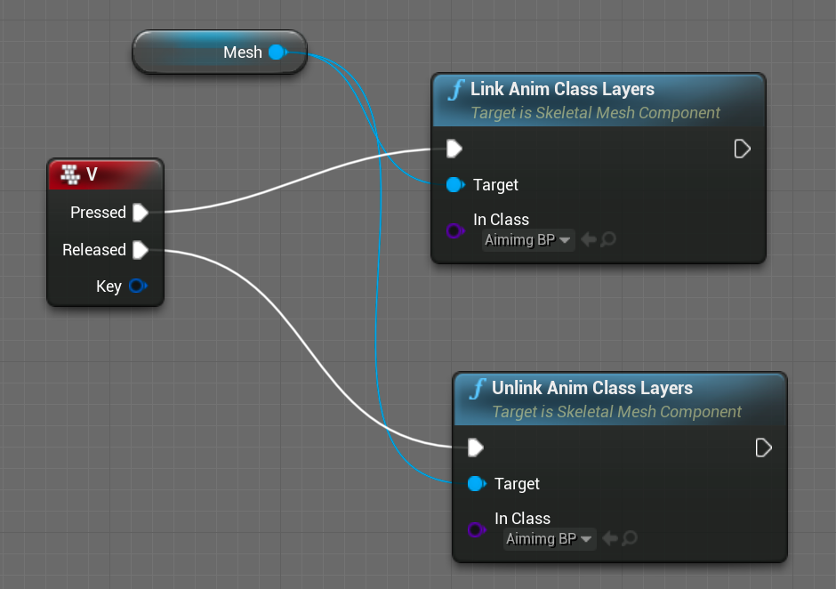

因为是AimOffset，所以要使用Mesh Space Additive。

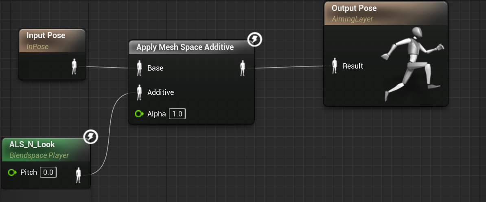

## Roll（蒙太奇动画与根运动）

暂停当前动画，播放蒙太奇动画。注意要使用根运动，否则，播放蒙太奇动画过程中仅mesh移动，外部胶囊体仍留在原地。

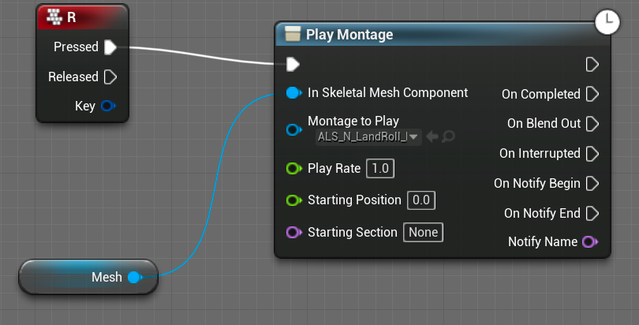

## Ragdoll

布娃娃系统，注意对各个部件的碰撞设置。

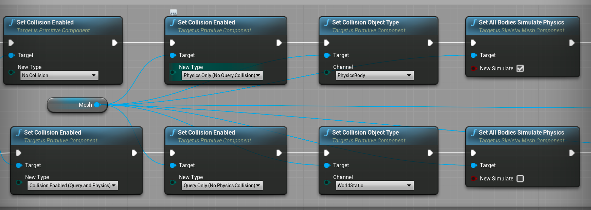

## 眼睛与脚部闪烁（动画曲线的应用）

在动画过程中，设置曲线，使得脚步与地面接触时，曲线值增大，从而实现，眼睛发光和脚部发光。

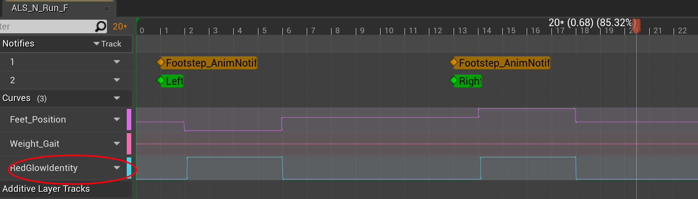

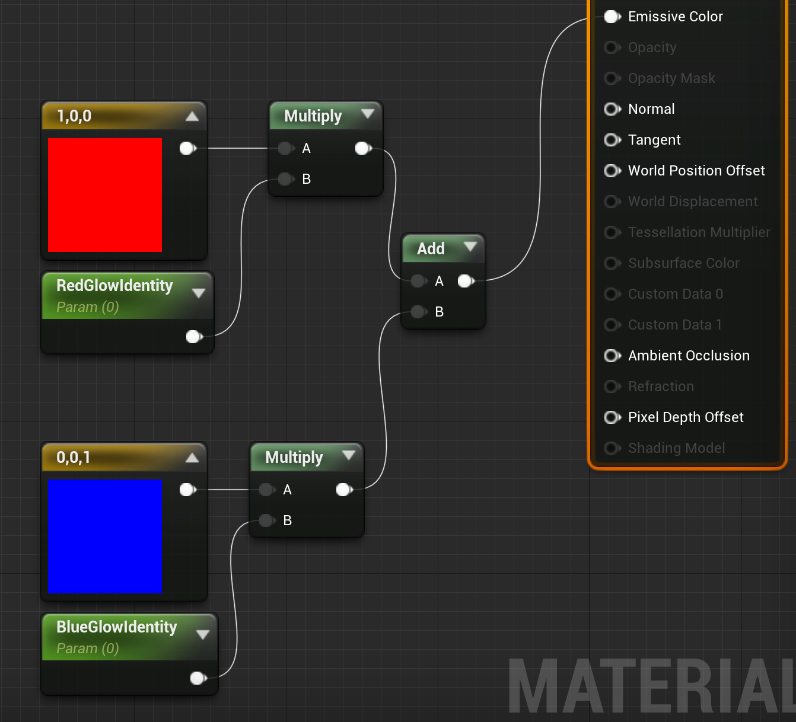
